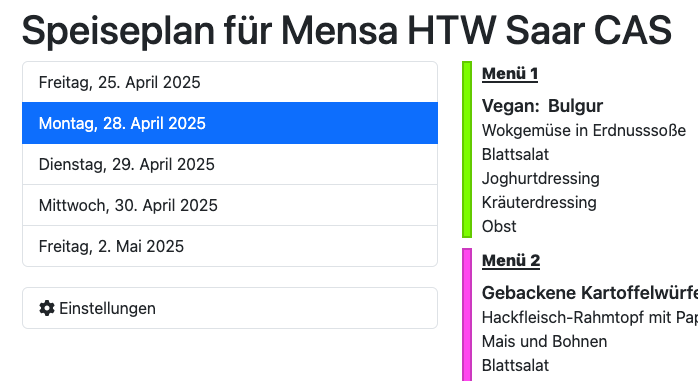

# Mensaar Show Next Day

A userscript that switches to the meal plans for the next day when the canteen has already closed for today.

On a Monday after 2:30 pm, it will show the meal plan for Tuesday (if the canteen is opened). Before 2:30 pm, it will show the meal plan for Monday. The time in Germany is used to determine this.

## Example

## Screenshot

